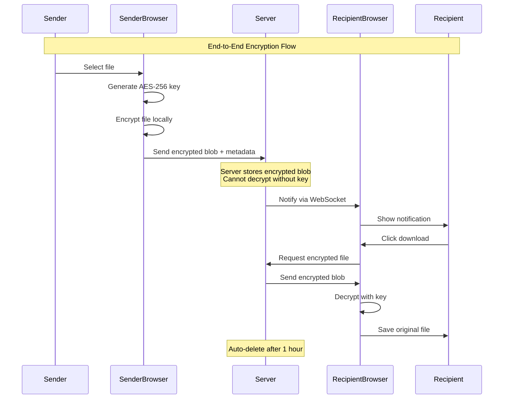
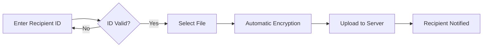
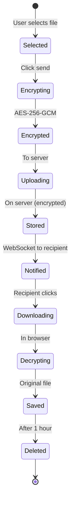

# xsukax Secure Share - Zero-Knowledge E2E Encrypted File Transfer

<div align="center">


**Secure, private, and simple file sharing with end-to-end encryption**

[Features](#features) • [Security](#security) • [Installation](#installation) • [Usage](#usage) • [Architecture](#architecture)

</div>

## Overview

xsukax Secure Share is a zero-knowledge file sharing application that ensures complete privacy through client-side encryption. Files are encrypted in your browser before upload, and only the intended recipient can decrypt them. The server never has access to your files or encryption keys.

## Features

### 🔐 Security & Privacy
- **End-to-End Encryption**: AES-256-GCM encryption happens in your browser
- **Zero-Knowledge Architecture**: Server never sees unencrypted data or keys
- **Automatic Deletion**: Files are permanently deleted 1 hour after download
- **No Account Required**: Anonymous usage with simple 6-character IDs
- **No Tracking**: No analytics, cookies, or user tracking

### ⚡ Performance & Usability
- **Large File Support**: Transfer files up to 1GB
- **Real-time Notifications**: WebSocket-based instant file notifications
- **Minimal Design**: Clean, modern interface with one-click operations
- **Click-to-Copy IDs**: Simple ID management with visual feedback
- **Drag & Drop**: Intuitive file selection

### 🛠 Technical Features
- **Auto-start Service**: Runs as systemd service on boot
- **Self-hosted**: Complete control over your data
- **Cloudflare Tunnel Compatible**: Works behind CDN/tunnels
- **Mobile Responsive**: Works on all devices

## Security Architecture



## Installation

### Prerequisites
- Node.js 14+ 
- Linux server (Ubuntu/Debian/CentOS)
- Root access for service installation

### Quick Install

```bash
# Download the installer
curl -O https://raw.githubusercontent.com/xsukax/xsukax-Secure-Share/refs/heads/main/xsukax-Secure-Share.sh

# Run as root
sudo bash xsukax-Secure-Share.sh
```

The installer will:
1. Create a system service user
2. Install in `/opt/secureshare`
3. Configure systemd for auto-start
4. Start the service on port 3456
5. (Optional) Configure nginx proxy

### Manual Installation

```bash
# Clone repository
git clone https://github.com/xsukax/xsukax-Secure-Share.git
cd xsukax-Secure-Share

# Install dependencies
npm install

# Start manually
node server.js
```

## Usage

### Service Management

```bash
# Check service status
systemctl status secureshare

# View logs
journalctl -u secureshare -f

# Restart service
systemctl restart secureshare

# Stop service
systemctl stop secureshare
```

### Basic Usage

#### 1. Access the Application
Navigate to `http://your-server:3456` in your browser

#### 2. Generate Your ID
- Click "Get Started" 
- Your unique 6-character ID appears
- Click the ID to copy it instantly

#### 3. Send a File


1. Enter the recipient's 6-character ID
2. Drag & drop or click to select file (max 1GB)
3. Click "Send Encrypted"
4. File is encrypted in your browser before upload

#### 4. Receive a File
- Files appear automatically when received
- Click "Download" to fetch and decrypt
- Original file is saved to your downloads

### API Endpoints

| Endpoint | Method | Description |
|----------|--------|-------------|
| `/api/user/create` | POST | Generate new user ID |
| `/api/user/verify/:id` | GET | Verify user exists |
| `/api/file/upload` | POST | Upload encrypted file |
| `/api/file/download/:id` | GET | Download encrypted file |
| `/api/transfers/:userId` | GET | List received files |

## File Lifecycle



## Privacy Guarantees

### What the Server NEVER Sees:
- ❌ Unencrypted file contents
- ❌ Decryption keys (only passed through)
- ❌ File types or real names (until metadata)
- ❌ User identities or personal information

### What the Server Sees:
- ✓ Encrypted blob (meaningless without key)
- ✓ File size and timestamp
- ✓ Sender and recipient IDs
- ✓ Connection IP addresses

## Security Best Practices

1. **Always verify recipient ID** before sending sensitive files
2. **Share IDs through secure channels** (not public posts)
3. **Download files promptly** (auto-deleted after 1 hour)
4. **Use on trusted networks** when possible
5. **Keep your ID private** like a password

## Configuration

### Environment Variables
```bash
PORT=3456              # Server port
NODE_ENV=production    # Environment mode
```

### File Limits
- Maximum file size: 1GB
- Auto-deletion: 1 hour after download
- Storage location: `/opt/secureshare/uploads`

## Browser Compatibility

| Browser | Minimum Version | Status |
|---------|----------------|---------|
| Chrome | 90+ | ✅ Full support |
| Firefox | 88+ | ✅ Full support |
| Safari | 14+ | ✅ Full support |
| Edge | 90+ | ✅ Full support |
| Opera | 76+ | ✅ Full support |

## Troubleshooting

### WebSocket Connection Issues
```bash
# Check if WebSocket is blocked
curl -i -N -H "Connection: Upgrade" -H "Upgrade: websocket" http://localhost:3456
```

### File Upload Failures
- Check file size (max 1GB)
- Verify recipient ID exists
- Ensure adequate disk space

### Service Won't Start
```bash
# Check logs
journalctl -u secureshare -n 50

# Verify port availability
sudo lsof -i :3456

# Check permissions
ls -la /opt/secureshare
```

## Contributing

Contributions are welcome! Please ensure:
- Code follows existing style
- Security is not compromised
- Tests pass before submitting PR


## License

GNU General Public License v3.0 - see [LICENSE](LICENSE) file for details

## Acknowledgments

- Web Crypto API for browser encryption
- Express.js for server framework
- WebSocket for real-time notifications

---

<div align="center">
Built with 🔐 for privacy advocates
</div>
